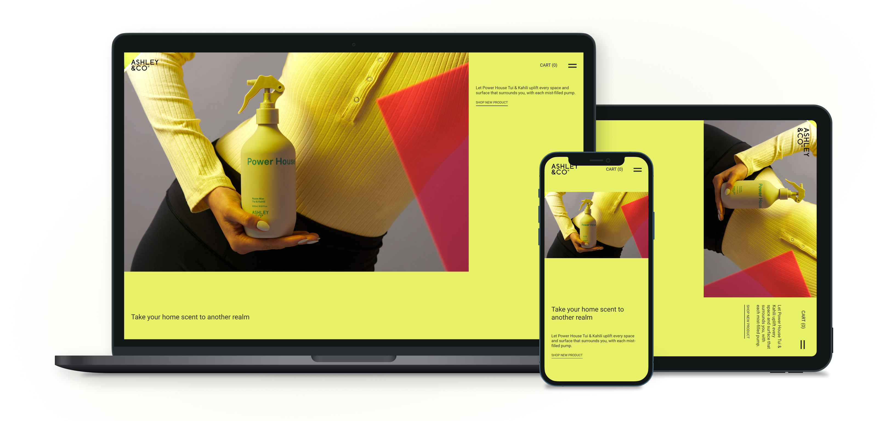

# ASHLEY&CO

## Landing page for parfume store

This is a sample landing page i have maded for e-commerce porfume store that called "ASHLEY&CO", _let Power house Tui & Kahili uplift every space and surface that surrounds you, with each mist-filled pump._

## Table of contents

- [Overview](#overview)
  - [Adaptive](#adaptive)
  - [Links](#links)
  - [Tasks](#tasks)
- [My process](#my-process)
  - [Built with](#built-with)
  - [What I learned](#what-i-learned)
  - [Continued development](#continued-development)
  - [Useful resources](#useful-resources)
  - [Set up](#set-up)
- [Contacts](#contacts)

## Overview

### Adaptive

### Links

- Live [site](https://voladdd.github.io/lgp-ashley-co/)
- Figma [file](https://www.figma.com/file/wZg1bRFKbiIPoZsfpZMhXN/Ashley%26Co?node-id=0%3A1)

### Tasks

#### Starter checkout list

- [x] Create file structure: assets & src
- [x] Add index, style files
- [x] Download all content of sections splitted in assets
- [x] Download neccessary fonts
- [x] Create root font sizes
- [x] Create root colors

#### HTML

- [x] Create html using semantic elements
- [x] Layout
- [x] Proper alt names

#### CSS

- [x] Responsive design for mobile, tablet, pc
- [x] Custom scrollbar

#### JS

- [x] Smooth scrool between sections
- [x] Fade animations on scroll
- [x] Closable popup message

## My process

### Set up

#### Launch SASS to watch folder:

`sass --watch src/scss:src/public`

#### Start live static server

`npx serve`

### Built with

- HTML
- SASS, CSS
- Vanilla JS
- CSS grid, flexbox

### What I learned

In this project ive learned how to use some of HTML semantic elements such as form, sections, and it's approved for me usefullnes of this thing. Also ive added observer to detect whenever section get showed on user view and then play smooth fade animation. And the last cool feature was scrool snaping, that give me ability to snap user view to whole section.

### Continued development

In future project im planning to collobarate with designers to implement unusual sites layout, master my grid technique, and start learning about speed perfomance and adoption for end user.

### Useful resources

- [mdn web docs](https://developer.mozilla.org/) - This helps me with learning all web tecnhologies, with a lot of examples and additional useful resources.
- [w3schools](https://www.w3schools.com/) - There i find some more extended and different code samples.
- [doka](https://doka.guide/) - Hard things described with simple words, and tons of best practices.

## Contacts

- Github - [@voladdd](https://github.com/voladdd)
- Linkedin - [link](https://www.linkedin.com/in/vlad-selivanov-190725212/)
- Email - artosan360@gmail.com
